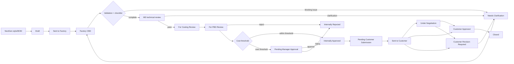

# Smart TP Costing Approval Workflow v2

**Status:** Implemented in the localhost application

## Operating model

The request has two related but separate tracks:

1. **Internal costing approval:** Factory → MD technical review → Costing validation → PBD approval → Manager threshold approval (only when required). The MD technical review now runs **before** costing validation.
2. **Customer lifecycle:** PBD records submission, negotiation, customer decision, revision, and closure after internal approval.

“Internally Approved” does not mean “Customer Approved”. Customer approval is recorded separately in `customer_status`.

## End-to-end flow

## Approval rules

- MD/Admin records the technical review right after the factory CBD submission (request in `for_md_review`). A passing review advances the request to `for_costing_review`; a clarification decision returns it to the factory correction queue.
- Costing Team then completes the required validation checklist and routes the request to `for_pbd_review`.
- A passing MD review is required before PBD can approve the request (recorded earlier in the workflow). PBD may reject with an explanation when the request is not acceptable.
- PBD/Admin owns normal `approve` and `reject` decisions from `for_pbd_review`.
- The configured landed-cost threshold is evaluated after PBD approval. Requests above it become `pending_manager_approval`.
- Only Manager/Admin can execute `manager_approve` or `manager_reject` from `pending_manager_approval`.
- Single and bulk approval use the same server-side action service. Both enforce checklist, validation, compliance, historical snapshot, actor identity, and optimistic-lock rules.
- RSL and REACH checks are hard gates. `pending`, `failed`, `rejected`, and non-compliant results prevent internal approval until resolved.

## PBD pricing ownership

Factory CBD captures the factory cost basis. PBD records wholesale/retail selling prices and markups in the **PBD Pricing** section during internal review. These values are stored on the costing request (`pbd_pricing`) and are not accepted as factory-owned pricing input.

## Customer revision loop

When PBD records `customer_rejected_revised`:

1. The customer status becomes **Customer Revision Required**.
2. `customer_revision_number` increments and the decision is written to `customer_revision_history`.
3. The internal request moves to `needs_clarification` so Factory can correct the CBD.
4. Factory resubmits; the request passes through MD and Costing again before PBD approval.
5. After internal approval, PBD restarts the customer lifecycle at `pending_customer_submission`.

This is a controlled revision loop, not a direct customer-status jump or an untracked regression.

## Role ownership

| Role | Actions |
|---|---|
| Factory | Save/submit CBD; resubmit clarification revisions |
| Costing | Validate CBD, checklist, compliance, costing clarification |
| MD | Technical review of yarn, knit, machine, and construction |
| PBD | Create/send request, normal internal approve/reject, customer lifecycle, pricing |
| Manager | Approve/reject threshold exceptions |
| Admin | Controlled administrative equivalent of workflow actions |

## Audit and data guarantees

Every approval, MD review, customer revision, and PBD pricing update records actor role, authenticated user ID, timestamp, and workflow event. Approval updates use the current status as an optimistic lock, so a stale screen cannot overwrite another decision.
