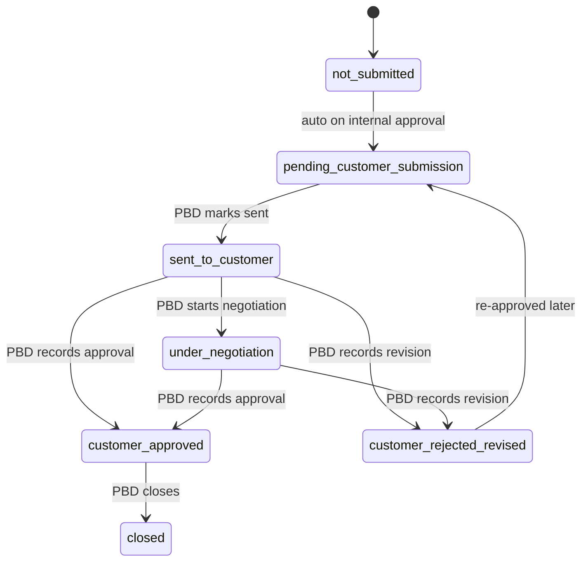
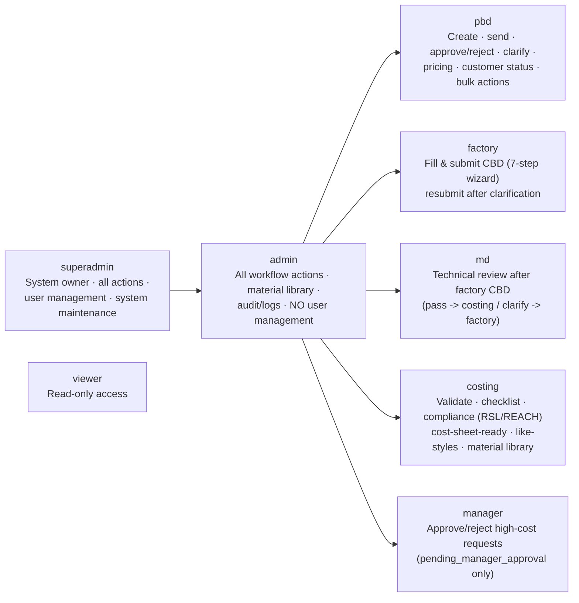
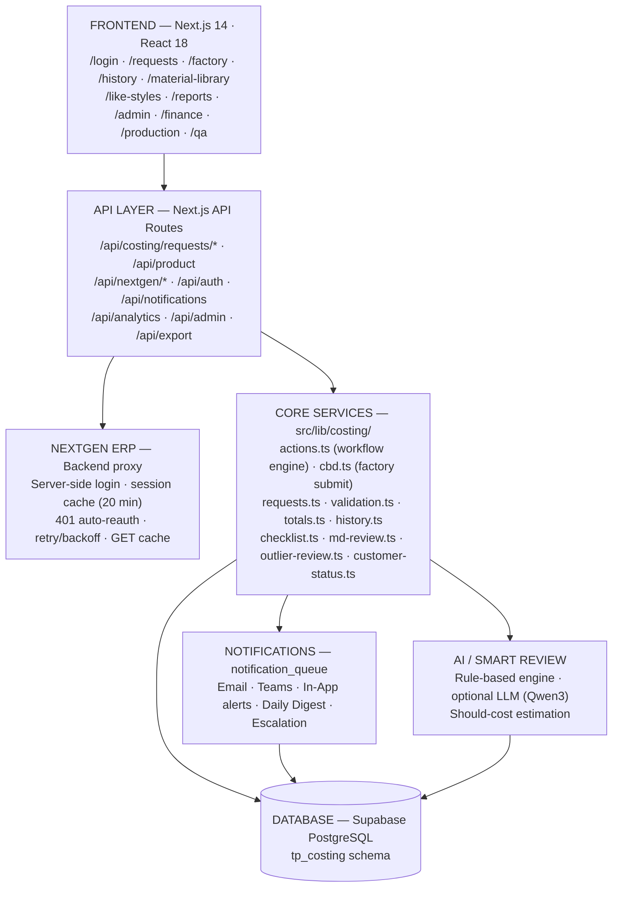

# Smart TP-to-Costing — Corrected System & Workflow Overview

> **Correction source:** verified against live code on 2026-08-18 (`src/lib/workflow/status.ts`,
> `src/lib/costing/actions.ts`, `src/lib/costing/cbd.ts`, `src/lib/costing/md-review.ts`,
> `src/lib/costing/customer-status.ts`, `src/lib/auth/roles.ts`, API routes under
> `src/app/api/costing/requests/**`). This file replaces the draft overview that incorrectly
> showed a request-level `closed` status and a `cancelled` status — **neither exists in the code**
> (see §5). Rendered PNGs: `docs/diagrams/corrected-*.png`.

---

## 1. End-to-End Costing Request Lifecycle (corrected — 8 stages, no CLOSED / CANCELLED)

```mermaid
flowchart LR
    subgraph ST1["1 · CREATE REQUEST — PBD"]
        direction TB
        A1["Pull style / BOM / PO / MPO from NextGen<br/>Snapshot BOM lines · CR-XXXXXX<br/>Block duplicate active style/factory"]
        A2["draft"]
        A1 --> A2
    end

    subgraph ST2["2 · SEND TO FACTORY — PBD / Admin"]
        direction TB
        B1["send_to_factory<br/>SLA timer starts · factory notified"]
        B2["sent_to_factory"]
        B1 --> B2
    end

    subgraph ST3["3 · FACTORY CBD — Factory / Admin"]
        direction TB
        C1["7-step CBD wizard<br/>System validates + benchmark variance<br/>On race, CBD insert is rolled back"]
        C2["for_md_review"]
        C3["needs_clarification"]
        C1 -->|"valid"| C2
        C1 -->|"blocking errors"| C3
    end

    subgraph ST4["4 · MD TECHNICAL REVIEW — MD / Admin"]
        direction TB
        D1["md_review (pass / clarify)"]
        D2["for_costing_review"]
        D3["needs_clarification"]
        D1 -->|"pass"| D2
        D1 -->|"clarify · notes required"| D3
    end

    subgraph ST5["5 · COSTING VALIDATION — Costing / Admin"]
        direction TB
        E1["costing_complete / costing_clarify<br/>4 required checklist items must be checked"]
        E2["for_pbd_review"]
        E3["needs_clarification"]
        E1 -->|"costing_complete"| E2
        E1 -->|"costing_clarify"| E3
    end

    subgraph ST6["6 · PBD REVIEW — PBD / Admin"]
        direction TB
        F1["approve / clarify / reject<br/>Gates: no validation errors · RSL/REACH ok ·<br/>pricing entered · MD passed · outliers acknowledged"]
        F2["approved"]
        F3["pending_manager_approval"]
        F4["needs_clarification"]
        F5["rejected"]
        F1 -->|"approve · cost <= threshold"| F2
        F1 -->|"approve · cost > threshold"| F3
        F1 -->|"clarify"| F4
        F1 -->|"reject"| F5
    end

    subgraph ST7["7 · MANAGER APPROVAL — Manager / Admin"]
        direction TB
        G1["manager_approve / manager_reject"]
        G2["approved"]
        G3["rejected"]
        G1 -->|"manager_approve"| G2
        G1 -->|"manager_reject"| G3
    end

    subgraph ST8["8 · APPROVED — System (automatic)"]
        direction TB
        H1["Save snapshot to historical_costings<br/>customer_status -> pending_customer_submission<br/>Request stays at approved (no closed status)"]
    end

    A2 -->|"send_to_factory · PBD"| B2
    B2 -->|"submit CBD · Factory"| C1
    C2 -->|"md_review · MD"| D1
    D2 -->|"costing_complete · Costing"| E1
    E2 -->|"PBD decision"| F1
    F3 -->|"manager decision"| G1
    F2 --> H1
    G2 --> H1

    C3 -.->|"factory resubmits"| C1
    D3 -.->|"back to factory"| C1
    E3 -.->|"back to factory"| C1
    F4 -.->|"back to factory"| C1
    H1 -.->|"customer_rejected_revised · rewinds request"| C1
```

---

## 2. Customer Status Lifecycle (post-approval, PBD-owned)

> This is a **separate track** from the request status. `closed` lives here — as the final
> **customer** state — never as a request status. `customer_rejected_revised` additionally rewinds
> the request status back to `needs_clarification` (factory correction loop) and writes a
> `customer_revision_history` row.

> `customer_rejected_revised` also rewinds the **request** status to `needs_clarification`
> (factory correction queue) and increments `customer_revision_number`.

---

## 3. Roles & Responsibilities (8 roles — verified)

> There are **no role-specific admins** ("PBD Admin", "Costing Admin", etc.). The Admin tier is
> exactly two roles: `admin` (every workflow action) and `superadmin` (adds user management and
> system maintenance). `viewer` is read-only.

---

## 4. System Architecture

---

## 5. Corrections vs. the previous draft overview

| Draft claim | Reality in code | Correction |
|-------------|-----------------|------------|
| Stage 8: request -> `closed` (System) | No request status `closed` exists. Request stays `approved`/`rejected`. On approval the system saves `historical_costings` and sets `customer_status = pending_customer_submission`. | Stage 8 = Approved -> Historical Save + start of customer lifecycle |
| Stage 9: any active -> `cancelled` (PBD/Admin) | No `cancelled` status, no cancel action, no cancel route anywhere. | Removed — not a feature (yet) |
| Roles: "PBD Admin / Costing Admin / Factory Admin / MD Admin" | Only `admin` and `superadmin` form the admin tier (`isAdminTier` in `roles.ts`). | Replaced with the verified 8-role list |
| Customer lifecycle missing | `customer_status` track + `customer_rejected_revised` rewind is a first-class flow (`customer-status.ts`). | Added as §2 |

### Verified transition map (traced from `actions.ts` + API routes)

| From | To | Action | R

| `draft` | `sent_to_factory` | `send_to_factory` | PBD / Admin |
| `sent_to_factory` · `needs_clarification` | `for_md_review` (valid) / `needs_clarification` (blocking) | `submit` | Factory / Admin |
| `for_md_review` | `for_costing_review` / `needs_clarification` | `md_review` (pass / clarify) | MD / Admin |
| `for_costing_review` | `for_pbd_review` / `needs_clarification` | `costing_complete` / `costing_clarify` | Costing / Admin |
| `for_pbd_review` | `approved` (<= threshold) / `pending_manager_approval` (> threshold) / `needs_clarification` / `rejected` | `approve` / `clarify` / `reject` | PBD / Admin |
| `pending_manager_approval` | `approved` / `rejected` | `manager_approve` / `manager_reject` | Manager / Admin |
| `approved` | `historical_costings` + `pending_customer_submission` | auto | System |
| `approved` (customer track) | `needs_clarification` | `customer_rejected_revised` | PBD / Admin |

**Approval gates (`assertApprovalAllowed` + `assertApprovalOutliersClear`):** no unresolved
`validation_results` errors · RSL/REACH not pending/failed · `pbd_pricing_status = entered` ·
latest MD review = `pass` · no unacknowledged high-risk outliers. Updates use an optimistic lock
(`eq("status", fromStatus)`).
