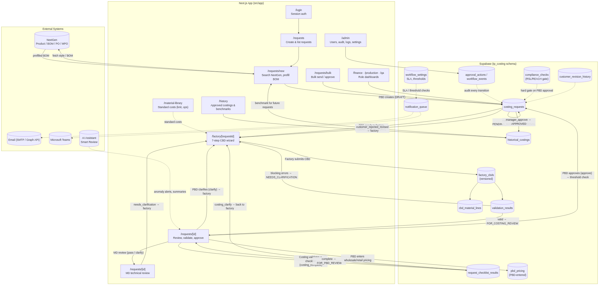
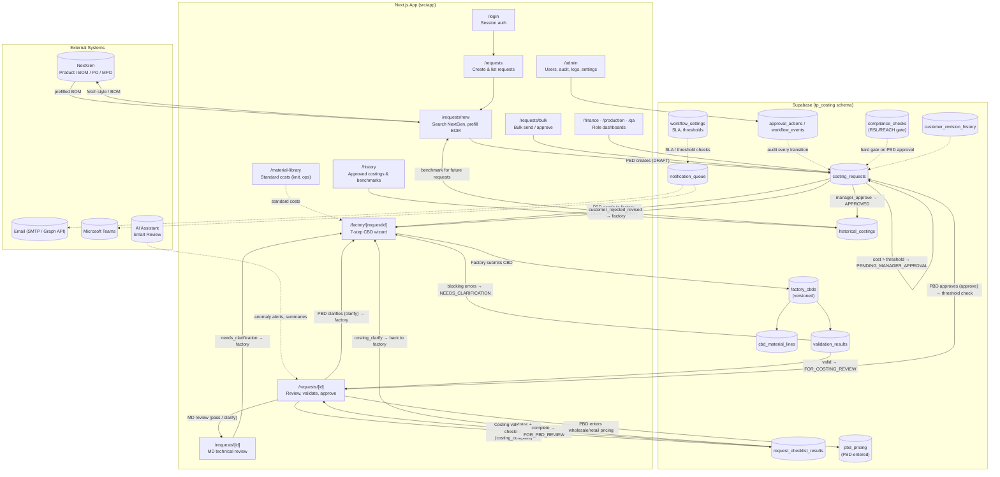
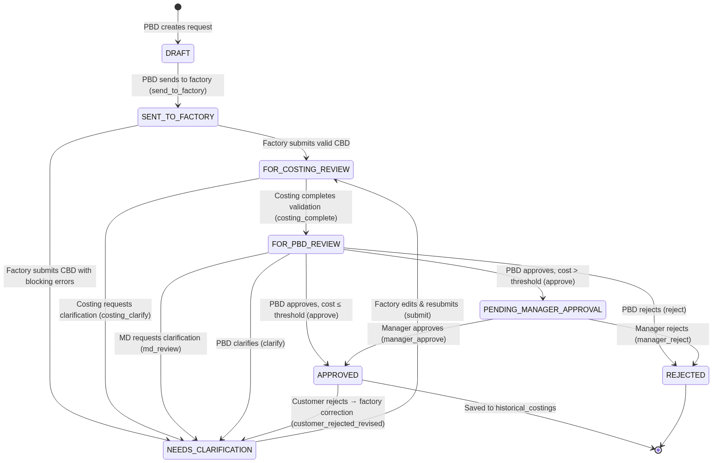
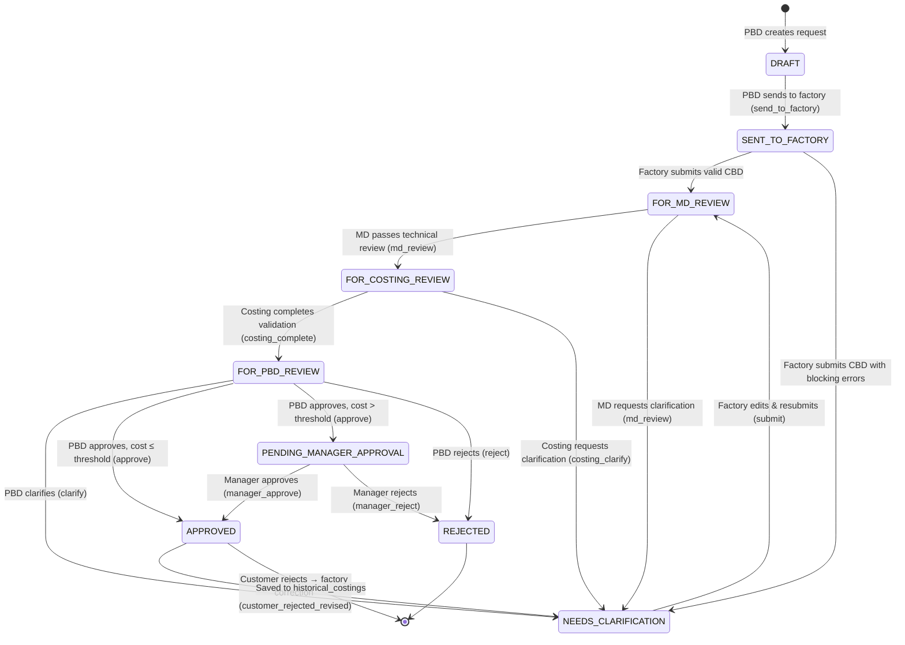
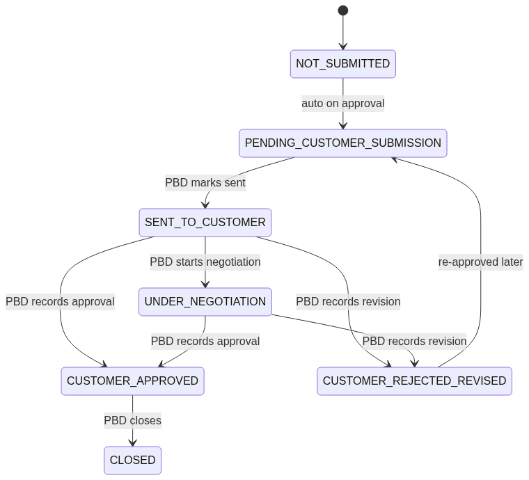
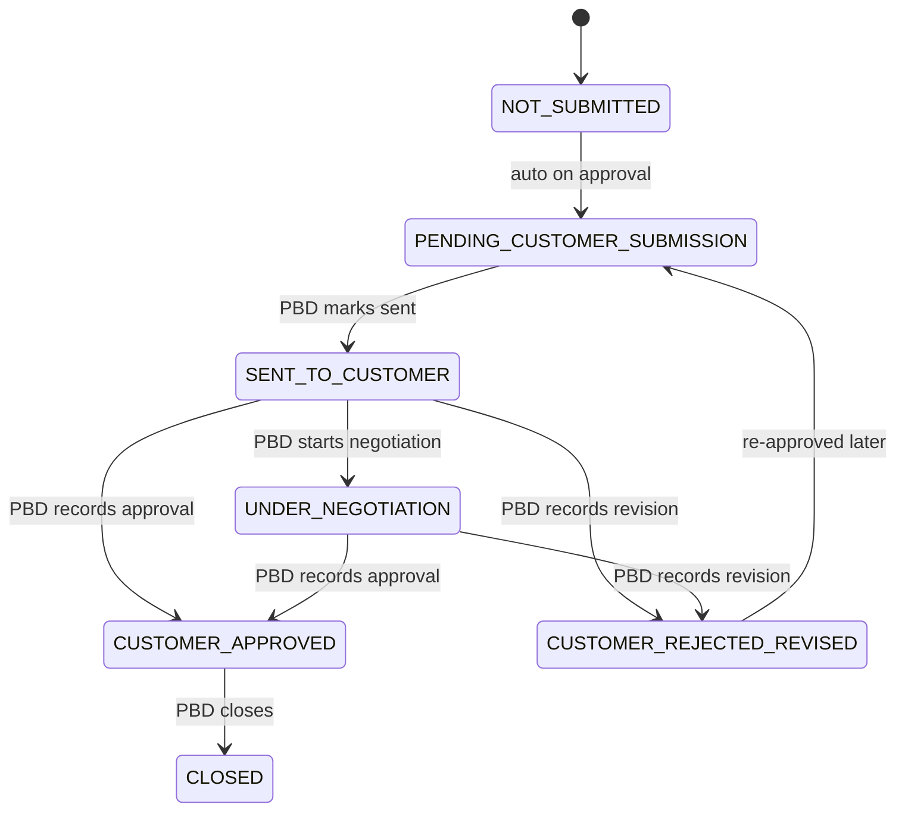
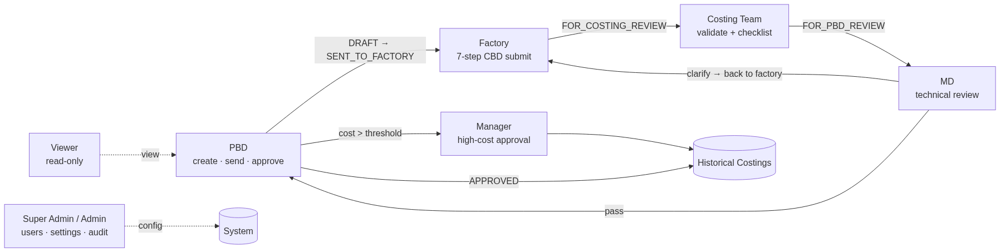
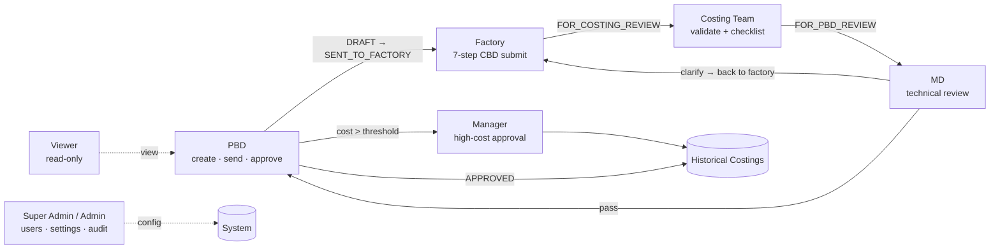
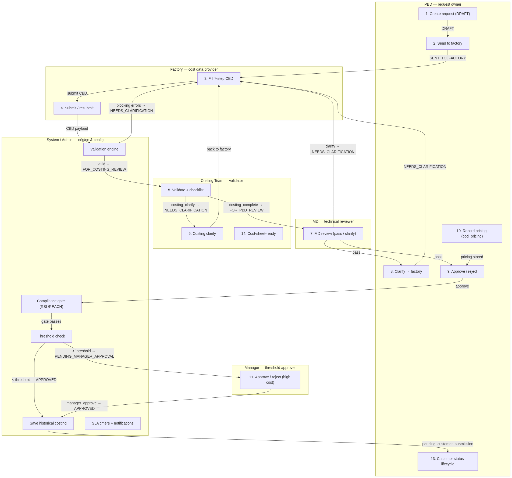
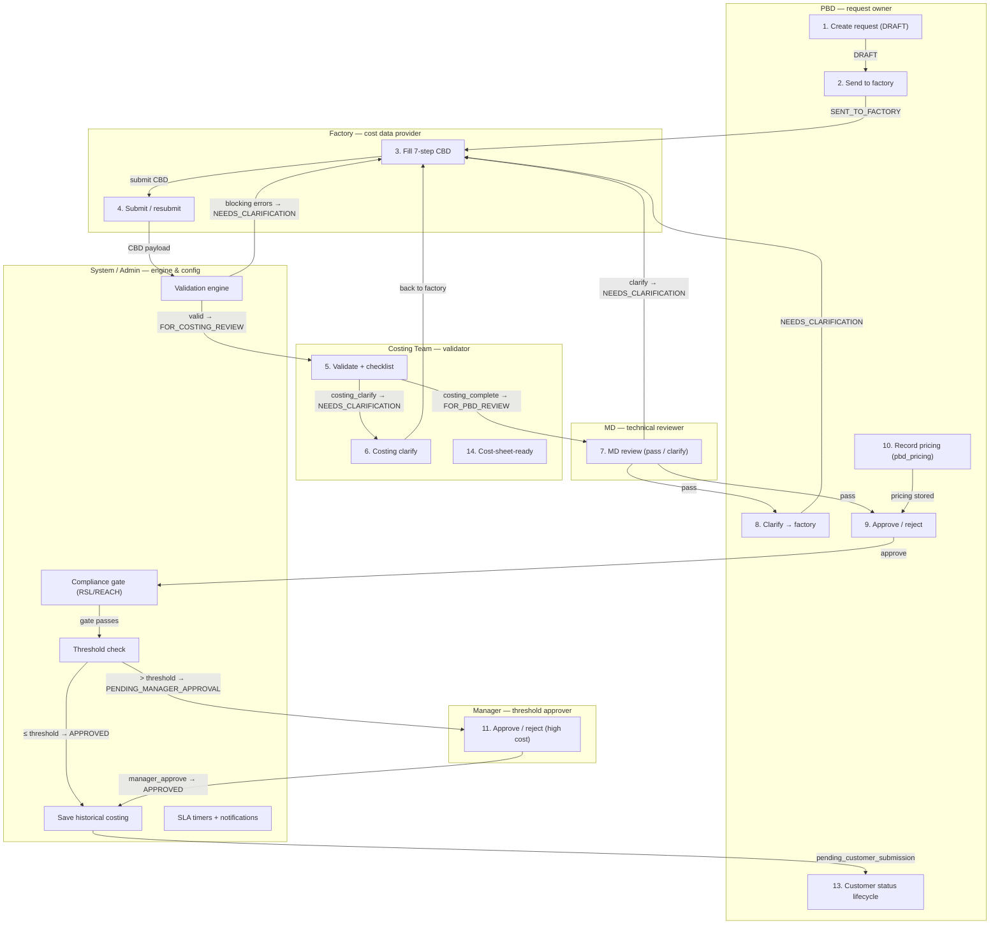

# Smart TP-to-Costing Approval Tool — System Flow & Role Functions

> **Audit status:** Verified against live code (2026-08-10), re-verified after the **v2 workflow** landed
> (canonical write-up: [`docs/approval-workflow-v2.md`](approval-workflow-v2.md)). The transition map in §3 is
> traced from `src/lib/costing/actions.ts`, `src/lib/costing/cbd.ts`, `src/lib/costing/requests.ts`,
> `src/app/api/costing/requests/[id]/actions/route.ts`, `.../cbd/route.ts`, `.../md-review/route.ts`,
> `.../pricing/route.ts`, `.../customer-status/route.ts`, `.../bulk-actions/route.ts`, and `src/lib/auth/roles.ts`.
> Where this document disagrees with older docs, **this document reflects the code** (see §5).
>
> **Rendered PNGs:** `docs/diagrams/` contains PNG exports of every diagram for viewers without Mermaid
> support. The Mermaid blocks below remain the editable source — re-render with `scripts/render-diagrams.mjs`.

---

## 1. End-to-End System Flow





### 1b. ASCII Version (plain-text — renders in any editor)

```text
SMART TP-TO-COSTING APPROVAL TOOL -- SYSTEM FLOW (ASCII)
========================================================

STAGE 1 - PBD creates and sends
  [NEXTGEN API] --style/BOM/PO/MPO--> [PBD] --create--> [DRAFT]
  [DRAFT] --send_to_factory--> [SENT TO FACTORY]

STAGE 2 - Factory fills CBD (7-step wizard)
  [SENT TO FACTORY] --submit--> [VALIDATION]
     valid (no blocking errors) -> [FOR MD REVIEW]
     blocking errors            -> [NEEDS CLARIFICATION]
  [NEEDS CLARIFICATION] --factory resubmits--> [FOR MD REVIEW]

STAGE 3 - MD technical review (before costing validation)
  [FOR MD REVIEW] --md_review pass--> [FOR COSTING REVIEW]
  [FOR MD REVIEW] --md_review clarify--> [NEEDS CLARIFICATION]
      (notes required; MD or Admin role)

STAGE 4 - Costing Team validation
  [FOR COSTING REVIEW] --costing_complete--> [FOR PBD REVIEW]
      (requires required checklist items checked)
  [FOR COSTING REVIEW] --costing_clarify--> [NEEDS CLARIFICATION]

STAGE 5 - PBD review / final decision
  [FOR PBD REVIEW] --clarify (PBD)--> [NEEDS CLARIFICATION]
                  --reject (PBD)------> [REJECTED]
                  --approve (PBD)-----> [THRESHOLD CHECK]
      guards: no blocking validation errors; RSL/REACH checks
              resolved (not pending/failed)
      PBD also records wholesale/retail pricing (pbd_pricing)
     cost <= threshold -> [APPROVED]
     cost >  threshold -> [PENDING MANAGER APPROVAL]

STAGE 6 - Manager approval (high-cost requests only)
  [PENDING MANAGER APPROVAL]
      --manager_approve--> [APPROVED]
      --manager_reject --> [REJECTED]

STAGE 7 - Approved
  [APPROVED] --saveHistoricalCosting--> [HISTORICAL COSTINGS]
      (feeds benchmarks for future requests)
    --customer_status = pending_customer_submission
     customer lifecycle (PBD):
       sent_to_customer -> under_negotiation -> customer_approved
       -> closed
       (customer_rejected_revised -> request back to
        NEEDS CLARIFICATION)

ROLE -> WORKFLOW STAGE
  PBD     : create, send_to_factory, approve/reject, clarify, pricing,
            customer status, bulk send/approve
  Factory : submit / resubmit CBD (7-step wizard)
  Costing : costing_complete, costing_clarify, checklist, compliance,
            cost_sheet_ready
  MD      : md_review (pass / clarify) during for_md_review
            (right after factory CBD submission, before costing)
  Manager : manager_approve / manager_reject (pending_manager_approval)
  Admin   : all of the above; Super Admin adds user mgmt +
            system maintenance
  Viewer  : read-only
```

---

## 2. Status Flow — as implemented (v2)





> Approving is blocked while an unresolved `validation_results` error exists or an RSL/REACH
> compliance check is pending/failed (`assertApprovalAllowed` in `actions.ts`).

### 2b. Customer Status Flow (post-approval, PBD-owned)





> Note: `customer_rejected_revised` also rewinds the request status to `needs_clarification`
> (factory correction queue) and writes a `customer_revision_history` row.

---

## 3. Verified Transition Map (traced from API routes)

| From | To | Action | Required role | Enforced where |
|------|----|--------|---------------|----------------|
| `draft` | `sent_to_factory` | `send_to_factory` | PBD or Admin | `actions/route.ts`; `validTransitions` in `actions.ts` |
| `sent_to_factory` | `for_md_review` (valid) / `needs_clarification` (blocking errors) | `submit` (CBD save/submit) | Factory or Admin | `cbd/route.ts` (`canSubmitFactoryCbd`); `cbd.ts` `resolveSubmitNextStatus` |
| `needs_clarification` | `for_md_review` / `needs_clarification` | `submit` (resubmit) | Factory or Admin | `cbd.ts` (submit allowed from `needs_clarification`) |
| `for_md_review` | `for_costing_review` | `md_review` (decision = pass) | MD or Admin | `md-review/route.ts` (only from `for_md_review`) |
| `for_md_review` | `needs_clarification` | `md_review` (decision = needs_clarification, notes required) | MD or Admin | `md-review/route.ts` |
| `for_costing_review` | `for_pbd_review` | `costing_complete` | Costing or Admin (required checklist items checked) | `actions.ts` `assertChecklistComplete` |
| `for_costing_review` | `needs_clarification` | `costing_clarify` | Costing or Admin | `actions/route.ts` |
| `for_pbd_review` | `needs_clarification` | `clarify` | PBD or Admin | `actions/route.ts` (also allowed from `needs_clarification`) |
| `for_pbd_review` | `approved` (cost ≤ threshold) / `pending_manager_approval` (cost > threshold) | `approve` | **PBD or Admin** | `actions/route.ts`; `actions.ts` threshold check vs `workflow_settings.manager_approval_threshold` (uses landed cost if > 0, else grand total) |
| `for_pbd_review` | `rejected` | `reject` | PBD or Admin | `actions/route.ts` |
| `pending_manager_approval` | `approved` | `manager_approve` | Manager or Admin | `actions.ts` (saves historical costing) |
| `pending_manager_approval` | `rejected` | `manager_reject` | Manager or Admin | `actions.ts` |
| `approved` | (flag) `cost_sheet_ready` | `cost_sheet_ready` | Costing or Admin | `cost-sheet-ready/route.ts` + bulk |
| `approved` | customer-status lifecycle | `customer-status` | PBD or Admin | `customer-status/route.ts` (`transitions` map) |
| any approved | `needs_clarification` | `customer_rejected_revised` | PBD or Admin | `customer-status/route.ts` |
| (during review) | `pbd_pricing` stored on request | `pricing` | PBD or Admin | `pricing/route.ts` (`canRunPbdAction`) |

Guards on approve (single and bulk, both via `runCostingAction`): no unresolved `validation_results` with
`severity = error`, RSL/REACH compliance not pending/failed, and complete required checklist. Updates use an
optimistic lock (`eq("status", fromStatus)`).

---

## 4. Role Functions (8 roles)

| Role | Code | Primary Function | What They Can Do (from `roles.ts` + routes) |
|------|------|------------------|----------------------------------------------|
| **Super Admin** | `superadmin` | System owner | Everything + user management (`canManageUsers`) + system maintenance — sync, import, escalation triggers (`canPerformSystemMaintenance`) |
| **Admin** | `admin` | Administrator | All workflow actions (create, CBD, costing validation, MD review, PBD approve/reject, manager approve/reject), material library, admin pages (audit/logs) — but NOT user management |
| **PBD** | `pbd` | Request owner + approver | Create request from NextGen, `send_to_factory`, **`approve` / `reject` (normal internal approval)**, `clarify`, PBD pricing (`pbd_pricing`), customer-status lifecycle, vendor quotes, sample tracking, bulk send + bulk approve |
| **Costing Team** | `costing` | Validator | `costing_complete` / `costing_clarify`, checklist, compliance checks (RSL/REACH), like-style comparisons, cost-sheet-ready (single + bulk), material library, AI should-cost |
| **Factory** | `factory` | Cost data provider | Fill/submit the 7-step CBD form, save drafts, resubmit after clarification or customer revisions |
| **MD (Merchandising)** | `md` | Technical reviewer | `md_review` from `for_md_review` (after factory CBD submission): decision `pass` (advances to `for_costing_review`) or `needs_clarification` (back to factory, notes required) |
| **Manager** | `manager` | Threshold approver | `manager_approve` / `manager_reject` from `pending_manager_approval` (high-cost requests only) |
| **Viewer** | `viewer` | Read-only | Sees all statuses, no actions |

### Role → Workflow Step Mapping





---

## 4b. Swimlane — Who Owns Each Step

> Lanes are the roles; boxes are the workflow steps. Arrows are handoffs (with the resulting status).
> The System lane = validation engine, compliance gate, threshold check, historical save, SLA timers — plus
> the Admin tier, which can act in any role lane. Viewer has no lane (read-only).





**ASCII version (plain-text):**

```text
SWIMLANE - WHO OWNS EACH STEP (ASCII)
Columns are roles; OWN = the role performs that step.

  STEP                   PBD  Factory Costing MD   Manager System
------------------------ ---- ------- ------- ---- ------- ------
  1. create request      OWN
  2. send to factory     OWN
  3. fill 7-step CBD          OWN
  4. submit / resubmit        OWN
  5. validation engine                                     OWN
  6. validate checklist               OWN
  7. costing_clarify                  OWN
  8. MD review                                OWN
     (pass keeps status; clarify -> step 3)
  9. approve / reject    OWN
  10. record pricing     OWN
  11. compliance gate                                      OWN
  12. threshold check                                      OWN
  13. manager approval                             OWN
  14. save historical                                      OWN
  15. customer status    OWN
  16. cost-sheet-ready                OWN
  17. SLA timers                                           OWN
     (blocking -> back to step 3)

  HANDOFFS (in flow order):
    PBD (1 -> 2) -> Factory (3 -> 4) -> System (5) -> Costing (6 -> 7)
    -> MD (8) -> PBD (9 -> 10) -> System (11 -> 12) -> Manager (13)
    -> System (14) -> PBD (15)

  LOOPS BACK TO STEP 3:
    - blocking validation errors (step 5)
    - costing_clarify (step 7)
    - MD clarify (step 8)
    - PBD clarify (step 9)
    - customer_rejected_revised (step 15)

  NOTE: Admin tier can act in any lane; Super Admin adds user
  management + system maintenance. Viewer has no lane.

```

---

## 5. Audit History — v1 findings and their v2 resolution

This document was first audited against the code as it stood before the v2 workflow landed. That audit
found several places where the code contradicted the older docs (`docs/user-flow.md`). The **v2 workflow
implementation has since resolved most of them** — verified in the code on 2026-08-10:

| Earlier finding (v1) | Status after v2 |
|----------------------|-----------------|
| `approve`/`reject` required Manager, not PBD | **Resolved** — PBD owns normal approval again (`actions/route.ts`, `actions.ts`) |
| Threshold routing happened on Manager's approve | **Resolved** — PBD's `approve` routes over-threshold costs to `pending_manager_approval` |
| Compliance (RSL/REACH) recorded but not enforced | **Resolved** — `assertApprovalAllowed` blocks approval on pending/failed RSL/REACH |
| MD role defined but not wired | **Resolved** — `md_review` route + `MdReviewPanel` implemented (only from `for_md_review`, before costing validation) |
| Bulk approve used a separate PBD-gated path that skipped `saveHistoricalCosting` | **Resolved** — bulk now calls the same `runCostingAction` service (same role gate, checklist, compliance, historical snapshot, optimistic lock) |
| Landed cost rode on the factory CBD schema; no PBD pricing step | **Resolved** — PBD pricing stored on the request (`pbd_pricing`, `pricing/route.ts`) |

Remaining caveats (still true in v2, by design):

1. `clarify` is also allowed from `needs_clarification`, not only `for_pbd_review` (`actions.ts`).
2. `md_review` with decision `pass` advances the request from `for_md_review` to `for_costing_review` (MD review precedes costing validation).
3. `customer_rejected_revised` rewinds an approved request to `needs_clarification` (controlled revision loop, documented in v2).
4. Statuses are "Internally Approved/Rejected" — an internal gate; the customer lifecycle is tracked separately in `customer_status`.

---

## 6. Function Summary by Role

- **PBD** — Searches NextGen by style / PO / MPO, creates the costing request, sends it to the factory, approves/rejects normal costings, clarifies (sends back for correction), records wholesale/retail pricing (`pbd_pricing`), manages the customer-status lifecycle, vendor quotes and sample tracking, and runs bulk send/bulk approve.
- **Costing Team** — Validates the factory CBD, runs the checklist (4 required + 3 optional), records compliance checks (RSL/REACH) and like-style comparisons, requests factory clarification, and marks approved cost sheets ready.
- **Factory** — Completes the 7-step CBD wizard (header, yarn, fabric & trim, knitting & operations, packaging & overhead/profit, notes, review & submit) and resubmits after clarification or customer revisions.
- **MD (Merchandising)** — Technical review of yarn, knit, machine, and construction right after the factory CBD submission: passes the request (advances to costing review) or sends it back to the factory with notes.
- **Manager** — Approves or rejects only the high-cost requests that exceed the manager-approval threshold.
- **Super Admin / Admin** — System configuration and all workflow actions; user & role management and system maintenance are Super Admin only.
- **Viewer** — Read-only access to requests, costings, and history.
